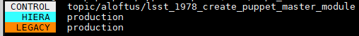

Tools for Puppet Development

## Requirements
* Python 3

## Dependencies
(For reference only, they will be installed during setup into a virtual
environment).
* Pip
  * colored
  * dashtable (which depends on bs4)
  * pyyaml

# Installation
1. `export PUP_DEV_BASE=/usr/local/src/puppet-dev`
1. `git clone https://github.com/ncsa/puppet-dev.git $PUP_DEV_BASE`
1. `$PUP_DEV_BASE/setup.sh`
1. `vim $PUP_DEV_BASE/bin/branches.sh`
    1. Check / Set values for:
       * REPO_NAMES
       * REFERENCE_NAMES
       * TOPIC_KEYWORD

# Usage
All commands:
* are installed to `/usr/local/bin`
* assume per-user puppet repo working directories exist at `$HOME/puppet/<repo_name>`

### branches
Report merge status of topic branches against mainline branches.

R10K creates dynamic environments from multiple repos, where `control` is
a puppet control repo, `hiera` contains private, secret data, and `legacy` has
local, private, unpublished modules.
* `branches`

Sample output: 

### repo_status
Show current branch for each repo (`control`, `hiera`, `legacy`).
* `repo_status`

### update_wip_env
Create the puppet environment `/etc/puppetlabs/code/environments/wip_<USERNAME>`
using contents of current working directories for each repo (`control`, `hiera`, `legacy`)
for testing live changes without commit-push-deploy cycle.

Note: `<USERNAME>` must be passed as a parameter on the cmdline
* root@puppet-master# `update_wip_env <USERNAME>`

### repo_checkout
Checkout the specified branch in each repo (`control`, `hiera`, `legacy`)

For each repo without a matching branch, checkout "production" instead.
* `/usr/local/bin/repo_checkout <TOPIC_BRANCH>`
