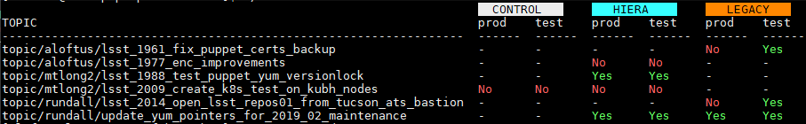

# Git Topic Merge Status
Report merge status of topic branches against mainline branches.

Supports multiple "mainline" branches (ie: `production`, `test`).

Supports multiple remote repositories (ie: `control`, `hiera`, `legacy`).

Sample use: Team of developers working on independant puppet updates across
multiple repositories.
Topic branches merge to `test` for testing, then to `production`
after review and/or during planned maintenance.
R10K creates dynamic environments from multiple repos, where `control` is
a puppet control repo, `hiera` contains private, secret data, and `legacy` has
local, private, unpublished modules.

## Requirements
* Python 3

## Dependencies
(For reference only, they will be installed during setup into a virtual
environment).
* Pip
  * colored
  * tabulate
  * pyyaml

# Installation
1. `export PUP_DEV_BASE=/usr/local/src/puppet-dev
1. `git clone https://github.com/ncsa/puppet-dev.git $PUP_DEV_BASE`
1. `$PUP_DEV_BASE/setup.sh`
1. `vim $PUP_DEV_BASE/branches.sh`
    1. Check / Set values for:
       * REPO_NAMES
       * REFERENCE_NAMES
       * TOPIC_KEYWORD

# Usage
* `/usr/local/bin/branches`

Sample output: 
